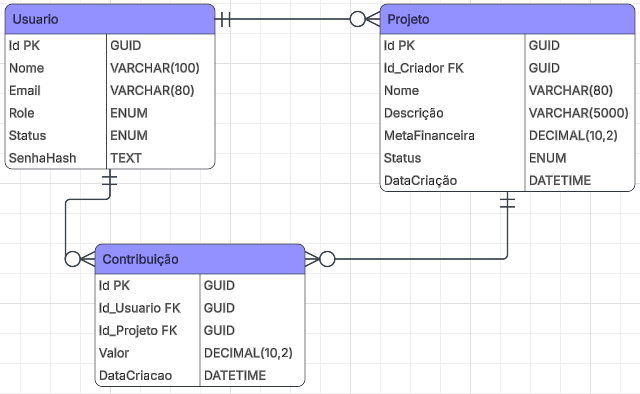

# 🔨 IndieForge

  

O IndieForge é uma plataforma de arrecadação voltada para desenvolvedores independentes de jogos digitais. Através dela, criadores podem apresentar projetos ainda em desenvolvimento para a comunidade, arrecadando recursos financeiros por meio de um sistema de apoio e pré-venda.
Em troca, os apoiadores podem receber recompensas definidas pelos próprios desenvolvedores, incentivando a participação da comunidade e ajudando a financiar a conclusão dos projetos.

## 🤔 Como ajuda no mercado de jogos?

O IndieForge busca incentivar o crescimento da indústria nacional de jogos independentes, oferecendo uma alternativa para desenvolvedores solo e pequenos estúdios que possuem boas ideias, mas enfrentam dificuldades para obter financiamento.
A plataforma funciona como uma ponte entre criadores e jogadores, permitindo que projetos promissores encontrem apoio antes do lançamento oficial, reduzindo o risco de abandono por falta de recursos e contribuindo para o fortalecimento do mercado independente.



> ## Aviso
>
> Este projeto possui finalidade exclusivamente educacional e de portfólio.
> Todas as contribuições financeiras são **simuladas** e nenhuma transação monetária real é realizada.

## ✨ Funcionalidades

### 👤 Usuário

- Pesquisar projetos publicados.
- Visualizar informações detalhadas de um projeto.
- Contribuir financeiramente para projetos.
- Consultar seu histórico de contribuições feitas por ele mesmo.

### 🎮 Criador

- Publicar novos projetos.
- Editar informações dos próprios projetos.
- Cancelar projetos publicados.
- Acompanhar o progresso da arrecadação.
- Visualizar a lista de apoiadores.

### 🛡️ Administrador

- Visualizar estatísticas gerais da plataforma.
- Bloquear/banir usuários.
- Ocultar projetos da plataforma.
- Consultar o histórico de projetos e contribuições para fins de auditoria.

## Roadmap

> ### Legendas
>
> 🟩 - Concluído | 🟨 - Em andamento | 🟥 - Não concluído | 🚀 - Em breve

### Back-end

<details>
<summary>Ver andamento do Back-end</summary>

### Infraestrutura

- 🟩 Configuração do Entity Framework Core
- 🟩 Modelagem das entidades
- 🟩 Configuração do Context
- 🟩 Autenticação JWT
- 🟩 Instâncias Seeds
- 🟩 Configuração do CORS
- 🚀 Tratamento global de exceções
- 🚀 Docker
- 🚀 Deploy na Azure

### Arquitetura

- 🟩 Criação dos DTOs
- 🟨 Implementação dos Services
- 🟥 Resolver repetição de código

### Segurança

- 🟩 Confirmação de e-mail
- 🟩 Recuperação de senha
- 🟩 Alteração de senha
- 🟨 Validação em entradas de dados
- 🚀 Rate Limiting
- 🚀 Autenticação em dois fatores (2FA)

### Projetos

- 🟩 Listar projetos
- 🟩 Buscar projeto por Id
- 🟩 Criar projeto
- 🟩 Pesquisar por nome
- 🟩 Filtrar projetos
- 🟩 Ordenação (mais recentes, mais arrecadados...)
- 🟩 Alterar meta do projeto (com restrição)
- 🟩 Cancelar projeto
- 🟩 Barra de progressão
- 🚀 Categorias (RPG, Plataforma, Terror...)
- 🚀 Upload de imagem de capa
- 🚀 Comentários
- 🚀 Avaliação de 0 a 5
- 🚀 Botão de Denúncia (fraudes, roubo, plágio e etc)

### Contribuições

- 🟩 Contribuir para um projeto
- 🟩 Histórico de contribuições de um projeto específico
- 🟩 Ranking de apoiadores por projeto
- 🚀 Recompensas por valor de contribuição

## Usuários

- 🟩 Visualizar perfil
- 🚀 Editar perfil
- 🚀 Alterar foto de perfil
- 🚀 Seguir criadores
- 🚀 Favoritar projetos
- 🚀 Conquistas

### Administração

- 🟥 Auditoria universal de contribuições
- 🟥 Média de transações por minuto (valor e quantos por vez)
- 🟥 Ocultar projeto
- 🟥 Bloquear usuário
- 🚀 Revogar tokens de acesso
- 🚀 Refresh tokens

</details>

---

<details>
<summary>Ver andamento do Front-end</summary>

### Telas

- 🟩 Home Page (apresentação de todos os projetos como visitante)
- 🟩 Tela de login/cadastro
- 🟩 Tela de mais detalhes de projeto
- 🟩 Tela do próprio perfil
- 🟥 Tela de Dashboard
- 🟥 Tela de criação de projeto

### Lógica e roteamento

- 🟩 Buscar por projetos
- 🟩 Login/Cadastro
- 🟨 Definição das URLs
- 🟥 Criação de projeto
- 🟥 Contribuição

</details>

# Tecnologias usadas
<details>
<summary><strong>Back-end</strong></summary>

- C#
- ASP.NET Core 8
- Minimal APIs
- Entity Framework Core
- JWT
- PasswordHasher
- PostgreSQL
- FluentValidation

</details>
<details>

<summary><strong>Front-end</strong></summary>

- React
- React Router
- Axios
- TypeScript
- Bootstrap
- Bootstrap Icons
- LocalStorage

</details>
<details>

<summary><strong>Outros</strong></summary>

- Swagger/OpenAPI
- Git
- Github
- Visual Studio

</details>

## Estrutura do projeto

<details>
<summary>Estruturação do projeto</summary>

```bash
IndieForge
├─ .agents
├─ Api
│  ├─ appsettings.json
│  ├─ Context
│  │  └─ AppDbContext.cs
│  ├─ DTOs
│  │  ├─ ChangeMetaFinanceiraDto.cs
│  │  ├─ ChangePasswordDto.cs
│  │  ├─ ContribuicaoDto.cs
│  │  ├─ ContributionResponseDto.cs
│  │  ├─ CreateContributionDto.cs
│  │  ├─ CreateProjectDto.cs
│  │  ├─ Dashboard
│  │  │  ├─ KPIsDto.cs
│  │  │  ├─ LogsAuditoryDto.cs
│  │  │  └─ TopActivitesDto.cs
│  │  ├─ EditProjectDto.cs
│  │  ├─ LoginDto.cs
│  │  ├─ LoginResponseDto.cs
│  │  ├─ ProjectCardDto.cs
│  │  ├─ ProjectDetailsDto.cs
│  │  ├─ ProjectResumeDto.cs
│  │  ├─ RegisterDto.cs
│  │  └─ ResponseMeDto.cs
│  ├─ IndieForge.csproj
│  ├─ IndieForge.http
│  ├─ IndieForge.slnx
│  ├─ Migrations
│  │  └─ Migrations...
│  ├─ Models
│  │  ├─ Contribuicao.cs
│  │  ├─ EmailConfirmationToken.cs
│  │  ├─ PasswordRecuperationToken.cs
│  │  ├─ Projeto.cs
│  │  ├─ Seeders
│  │  │  └─ DatabaseSeeder.cs
│  │  └─ User.cs
│  ├─ Program.cs
│  ├─ Properties
│  │  └─ launchSettings.json
│  ├─ Services
│  │  ├─ AccountService.cs
│  │  ├─ AdminService.cs
│  │  ├─ AuthService.cs
│  │  ├─ ContributionService.cs
│  │  └─ ProjectService.cs
│  └─ Validators
│     ├─ ChangeMetaFinanceiraDtoValidator.cs
│     ├─ ChangePasswordDtoValidator.cs
│     ├─ ContribuicaoDtoValidator.cs
│     ├─ CreateContributionDtoValidator.cs
│     ├─ CreateProjectDtoValidator.cs
│     ├─ EditProjectDtoValidator.cs
│     ├─ LoginDtoValidator.cs
│     └─ RegisterDtoValidator.cs
├─ front
│  ├─ index.html
│  ├─ package-lock.json
│  ├─ package.json
│  ├─ public
│  │  └─ logo.svg
│  ├─ README.md
│  ├─ src
│  │  ├─ App.tsx
│  │  ├─ assets
│  │  │  └─ logo.png
│  │  ├─ main.tsx
│  │  ├─ pages
│  │  │  ├─ Admin
│  │  │  │  └─ AdminCenter.tsx
│  │  │  ├─ Home
│  │  │  │  ├─ Home.styles.ts
│  │  │  │  └─ Home.tsx
│  │  │  ├─ Login
│  │  │  │  └─ Login.tsx
│  │  │  ├─ MyProfile
│  │  │  │  └─ MyProfile.tsx
│  │  │  ├─ ProjectDetails
│  │  │  │  ├─ ProjectDetails.styles.ts
│  │  │  │  └─ ProjectDetails.tsx
│  │  │  └─ Register
│  │  │     └─ Register.tsx
│  │  └─ routes.tsx
│  ├─ tsconfig.app.json
│  ├─ tsconfig.json
│  ├─ tsconfig.node.json
│  └─ vite.config.ts
├─ image.png
└─ README.md
```


</details>

## Como testar o projeto

- Primeiro de tudo, use `git clone <URL do projeto>` em um diretório desejável e certifique-se que tenha o **.NET 8** instalado em sua máquina.
- Depois, navegue até a pasta raiz do projeto
- Você também vai precisar de uma **Connection String**, e que deve ser de um banco de dados que utilize PostgreeSQL.
- Após pegar sua Connectrion Striing, vá até o arquivo `appsettings.json` e insira a string no local indicado.
- Digite `dotnet run` no terminal que aponta para a raiz do projeto e aguarde a aplicação inicializar.
- Após isso, poderá navegar até `http://localhost:5259/swagger/index.html` e testar a API através do Swagger.

### Registros Seeds

O projeto também tem Seeds para que outras pessoas possam testar o funcionamento da API de forma fácil. Quando começar a aplicação pela primeira vez, o seu banco de dados será preenchido com exatamente **10 Users**, **18 Projects** (pertecentes a alguns Users) e **21 Contributions**, variando entre cada projeto.

Para acessar e testar a API, é super simples. Na tela de Login, você pode escolher um destes nomes de usuários fictícios abaixo:

- Admin
- João Silva
- Mariana Costa
- Lucas Pereira
- Ana Oliveira
- Pedro Santos
- Carla Mendes
- Rafael Gomes
- Beatriz Almeida
- Thiago Ribeiro

A senha de cada um deles é simplesmente **User@x**, aonde **x** é sua posição na lista acima, de cima pra baixo. Por exemplo, o do **Admin** seria **User@1**.

É bom começar pelo Admin, já que esta conta possui privilégios de administrador que o permite explorar 100% do projeto, já que senão pode acabar sendo barrado por alguns trechos mais sensíveis por conta do JWT.